# Ecom_Data_Analysis


## Description:<br>
The e-commerce dataset from Amazon.in contains approximately 128,976 rows and 19 columns. The columns are described as follows:

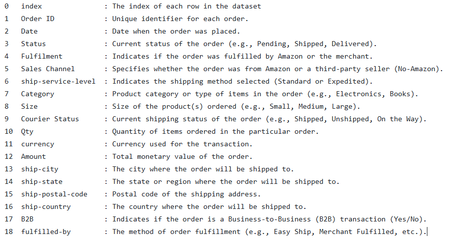

## Data Cleaning:<br>
```python
amz.info()
```
output:<br>

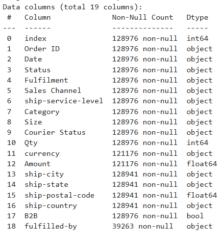

 As we can see the datatypes of Date, ship-postal-code, etc. are incorrect. Also, data contains Null values.

### Duplicate<br>
Displaying the duplicate rows:<br>
```python
amz[amz.duplicated()]
```

Finding the total number of duplicate rows:<br>
```python
amz.duplicated().sum()
```
There are 168 duplicate rows in dataset.

Removing duplicates:<br>
```python
display(amz.drop_duplicates(keep = False, inplace = True))
```

### Null Values<br>
Finding null values:<br>
```python
amz.isna().sum()
```
output:

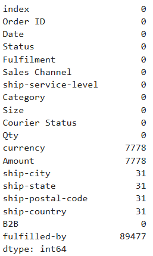

Since, ship-city, ship-state, ship-postal-code, ship-country has only 31 balnks, removing it.<br>
```python
amz.dropna(subset = 'ship-city',inplace=True)
```
Since, ship-city, ship-state, ship-postal-code, ship-country is a geographical data, deleting ship-city also delete corresponding ship-state, ship-postal-code, ship-country.

Finding unique values of currency column:<br> 
```python
pd.unique(amz['currency'])
```
array(['INR', nan], dtype=object)

Replacing Null with INR values:<br>
```python
amz.fillna({'currency':'INR'}, inplace = True)
```

Finding unique values of fulfilled-by column:<br> 
```python
pd.unique(amz['currency'])
```
array(['Easy Ship', nan], dtype=object)<br>

nan are replaced by Self ship:<br>
```python
amz.fillna({'fulfilled-by':'Self Ship'}, inplace = True)
```
In India, there are 28 States and 8 union terretories. But, in data there are soem duplicates values, some are in lowecase, uppercase or abbreviated form.<br>
```python
pd.unique(amz['ship-state']))
```
output:<br>


To solve this problem,<br>
```python
region = {'ANDAMAN & NICOBAR': 'ANDAMAN & NICOBAR ISLANDS',
 'ANDHRA PRADESH': 'ANDHRA PRADESH',
 'APO': 'ANDHRA PRADESH',
 'AR': 'ARUNACHAL PRADESH',
 'ARUNACHAL PRADESH': 'ARUNACHAL PRADESH',
 'ASSAM': 'ASSAM',
 'Arunachal Pradesh': 'ARUNACHAL PRADESH',
 'Arunachal pradesh': 'ARUNACHAL PRADESH',
 'BIHAR': 'BIHAR',
 'Bihar': 'BIHAR',
 'CHANDIGARH': 'CHANDIGARH',
 'CHHATTISGARH': 'CHHATTISGARH',
 'Chandigarh': 'CHANDIGARH',
 'DELHI': 'DELHI',
 'Delhi': 'DELHI',
 'DADRA AND NAGAR': 'DADRA AND NAGAR HAVELI AND DAMAN AND DIU',
 'GOA': 'GOA',
 'Gujarat': 'GUJARAT',
 'Goa': 'GOA',
 'HARYANA': 'HARYANA',
 'HIMACHAL PRADESH': 'HIMACHAL PRADESH',
 'JAMMU & KASHMIR': 'JAMMU & KASHMIR',
 'JHARKHAND': 'JHARKHAND',
 'KARNATAKA': 'KARNATAKA',
 'KERALA': 'KERALA',
 'LAKSHADWEEP': 'LAKSHADWEEP',
 'MADHYA PRADESH': 'MADHYA PRADESH',
 'MEGHALAYA': 'MEGHALAYA',
 'MIZORAM': 'MIZORAM',
 'Manipur': 'MANIPUR',
 'Meghalaya': 'MEGHALAYA',
 'Mizoram': 'MIZORAM',
 'NAGALAND': 'NAGALAND',
 'NL': 'NAGALAND',
 'Nagaland': 'NAGALAND',
 'New Delhi': 'DELHI',
 'ODISHA': 'ODISHA',
 'Odisha': 'ODISHA',
 'Orissa': 'ODISHA',
 'PB': 'PUNJAB',
 'PUDUCHERRY': 'PUDUCHERRY',
 'PUNJAB': 'PUNJAB',
 'Pondicherry': 'PUDUCHERRY',
 'Puducherry': 'PUDUCHERRY',
 'Punjab': 'PUNJAB',
 'Punjab/Mohali/Zirakpur': 'PUNJAB',
 'RAJASTHAN': 'RAJASTHAN',
 'RJ': 'RAJASTHAN',
 'Rajasthan': 'RAJASTHAN',
 'Rajshthan': 'RAJASTHAN',
 'Rajsthan': 'RAJASTHAN',
 'SIKKIM': 'SIKKIM',
 'Sikkim': 'SIKKIM',
 'TAMIL NADU': 'TAMIL NADU',
 'TELANGANA': 'TELANGANA',
 'TRIPURA': 'TRIPURA',
 'UTTAR PRADESH': 'UTTAR PRADESH',
 'UTTARAKHAND': 'UTTARAKHAND',
 'WEST BENGAL': 'WEST BENGAL',
 'bihar': 'BIHAR',
 'delhi': 'DELHI',
 'goa': 'GOA',
 'meghalaya': 'MEGHALAYA',
 'mizoram': 'MIZORAM',
 'nagaland': 'NAGALAND',
 'orissa': 'ODISHA',
 'punjab': 'PUNJAB',
 'rajasthan': 'RAJASTHAN',
 'rajsthan': 'RAJASTHAN',
 'sikkim': 'SIKKIM'}

amz['ship-state'] = amz['ship-state'].replace(region)
amz['ship-state'].sort_values().unique()
```
output:<br>

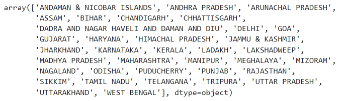

Now, sinse Amount column has countinuous data, plotting boxplot:<br>
```python
sns.boxplot(amz['Amount'])
plt.show()
```
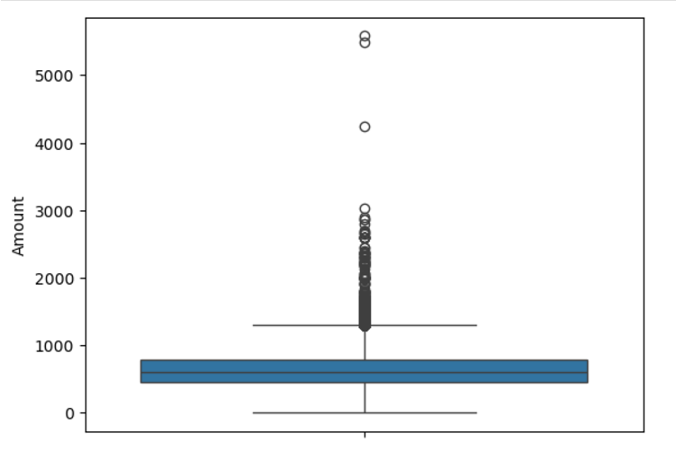

running descriptive analysis:<br>
```python
amz[['Amount']].describe()
```
output:<br>

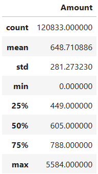

Since, Amount column has outliers, it makes sense to replace null values with median value.<br>
```python
amz.fillna(amz['Amount'].median(),inplace = True)
```
Now, our data is free from duplicates and Null values.<br>

Changing the name of Qty column to Quantity.<br>
```python
amz.rename(columns = {'Qty':'Quantity'}, inplace = True)
```
Changing datatype of 'Date' column:<br>
```python
amz['Date'] = pd.to_datetime(amz['Date'], format='mixed', dayfirst=True, errors='coerce')
```
Changing datatype of 'ship-postal-code' column:<br>
```python
amz['ship-postal-code'] = amz['ship-postal-code'].astype('int')
```
Since, Data given is of India location. Hence ship-country column has all entries as 'India'. It makes sense to remove that column.<br>
Since, Data given is of India location. Hence courancy column has all entries as 'INR'. It makes sense to remove that column.<br>
Since, In data there is Order ID which is unique for each order. Hence there is no need of index column. It makes sense to remove that column.<br>
```python
amz.drop(['index', 'currency', 'ship-country'], axis=1, inplace=True)
```

Again checking information about dataset:<br>
```python
amz.info()
```
output:<br>

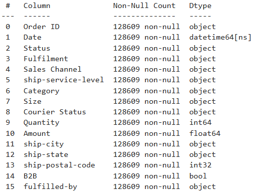

```python
amz.shape
```
(128609, 16)<br>
Now, data is cleaned and ready for Exploratory Data Analysis.<br>

# Exploratory Data Analysis (EDA):

### Distribution of Order Percentages by Months<br>
```python
order_counts = amz.groupby(amz['Date'].dt.to_period('M')).size()
order_percentages = (order_counts / len(amz)) * 100
order_summary = pd.DataFrame({'Order Count': order_counts, 'Percentage': order_percentages})
order_summary
```

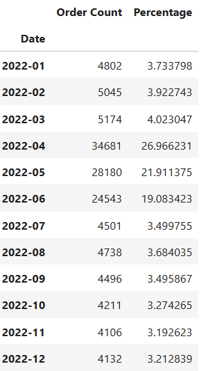

```python
st = sns.countplot(x=amz['Date'].dt.to_period('M'), order=amz['Date'].dt.to_period('M').sort_values().unique())
plt.xticks(rotation=90)
plt.grid(False)
plt.gca().get_yaxis().set_visible(False)

for p in st.patches:
    height = p.get_height()
    category = p.get_x() + p.get_width() / 2
    percentage = (height / len(amz)) * 100
    st.text(p.get_x() + p.get_width() / 2, height + 0.2, f'{percentage:.1f}%', 
            ha='center', va='bottom', fontsize=10)

plt.title('Percentage of orders in each month')
plt.show()
```
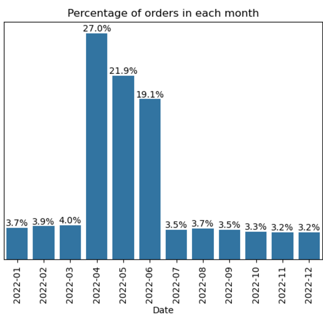

Insightes:<br>
Top 3 months with highest orders are:<br>
1) April<br>
2) May<br>
3) June<br>

### Distribution of Order Percentages by Status<br>
```python
order_counts = amz.groupby('Status').size()
order_percentages = (order_counts / len(amz)) * 100
order_summary = pd.DataFrame({'Order Count': order_counts, 'Percentage': order_percentages})
order_summary
```

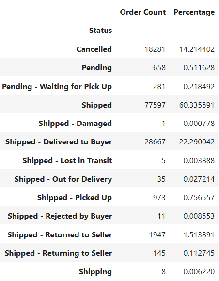

```python
st = sns.countplot(x='Status', data=amz, order=amz['Status'].value_counts().index)
plt.xticks(rotation=90)
plt.yscale('log')
plt.grid(False)
plt.gca().get_yaxis().set_visible(False)

for p in st.patches:
    height = p.get_height()
    category = p.get_x() + p.get_width() / 2
    percentage = (height / len(amz)) * 100
    st.text(p.get_x() + p.get_width() / 2, height + 0.2, f'{percentage:.3f}%', 
            ha='center', va='bottom', fontsize=10, rotation=45)

plt.title('Percentage of status of orders')
plt.show()
```

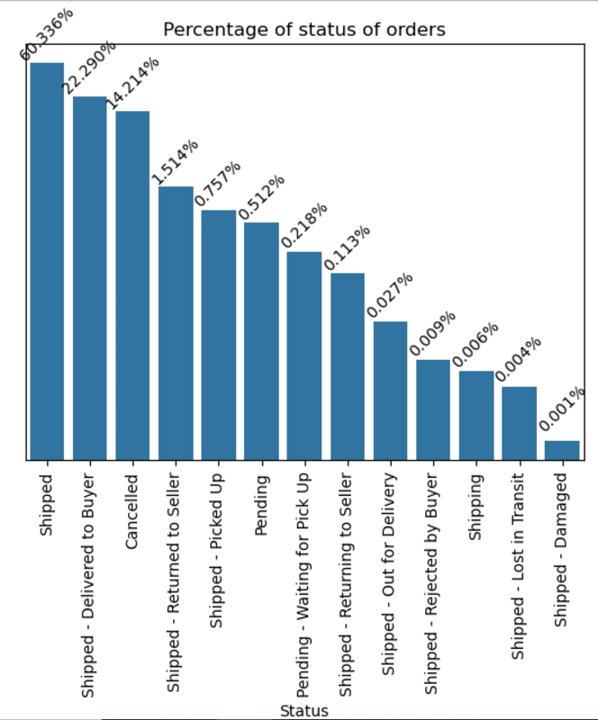

Insights:<br>
14.21% of the total orders are canceled, highlighting a negative aspect that could be improved.<br>

### Distribution of Order Percentages by Fulfilment<br>
```python
order_counts = amz.groupby('Fulfilment').size()
order_percentages = (order_counts / len(amz)) * 100
order_summary = pd.DataFrame({'Order Count': order_counts, 'Percentage': order_percentages})
order_summary
```

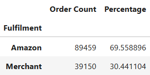

```python
plt.pie(amz['Fulfilment'].value_counts(), labels=amz['Fulfilment'].value_counts().index, autopct='%1.1f%%', startangle=90, colors=plt.cm.Paired.colors)
plt.title('Percentage of Orders Based on Fulfilment')
plt.show()
```


Insights:<br>
Approximately 70% of orders are fulfilled by Amazon, while the remaining 30% are handled by the merchant.<br>

### Distribution of Order Percentages by Sales Channel<br>
```python
order_counts = amz.groupby('Sales Channel').size()
order_percentages = (order_counts / len(amz)) * 100
order_summary = pd.DataFrame({'Order Count': order_counts, 'Percentage': order_percentages})
order_summary
```

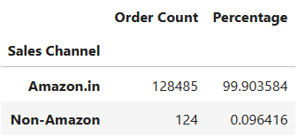

```python
plt.pie(amz['Sales Channel'].value_counts(), labels=amz['Sales Channel'].value_counts().index, 
        autopct='%1.1f%%', startangle=90, colors=plt.cm.Paired.colors)
plt.title('Percentage of Orders Based on Sales Channel')
plt.show()
```
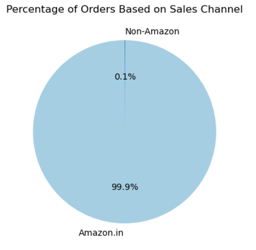

Insights:<br>
99.9% of order sales are through Amazon.<br>

### Distribution of Order Percentages by Ship Service Level<br>
```python
order_counts = amz.groupby('ship-service-level').size()
order_percentages = (order_counts / len(amz)) * 100
order_summary = pd.DataFrame({'Order Count': order_counts, 'Percentage': order_percentages})
order_summary
```

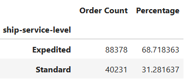

```python
plt.pie(amz['ship-service-level'].value_counts(), labels=amz['ship-service-level'].value_counts().index, 
        autopct='%1.1f%%', startangle=90, colors=plt.cm.Paired.colors)
plt.title('Percentage of Orders Based on ship-service-level')
plt.show()
```

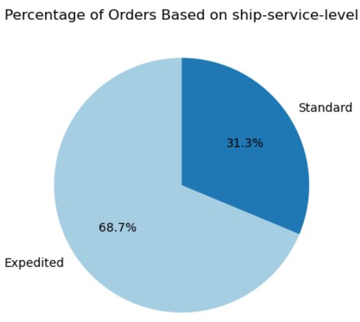

Insights:<br>
Expedited shipping accounts for 68.7% of orders, indicating a strong preference among customers for faster delivery over standard shipping options.<br>

### Distribution of Order Percentages by Category<br>
```python
order_counts = amz.groupby('Category').size()
order_percentages = (order_counts / len(amz)) * 100
order_summary = pd.DataFrame({'Order Count': order_counts, 'Percentage': order_percentages})
order_summary
```

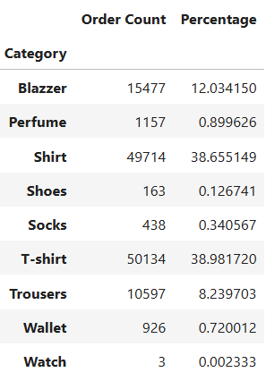

```python
plt.figure(figsize=(8,5))
st = sns.countplot(y='Category', data=amz, order=amz['Category'].value_counts().index)
plt.xscale('log')
plt.grid(False)
plt.gca().get_xaxis().set_visible(False)

for p in st.patches:
    width = p.get_width()
    category = p.get_y() + p.get_height() / 2
    percentage = (width / len(amz)) * 100
    st.text(width + 0.2, category, f'{percentage:.1f}%', 
            ha='left', va='center', fontsize=10)

plt.title('Percentage of Orders Based on Category')
plt.show()
```

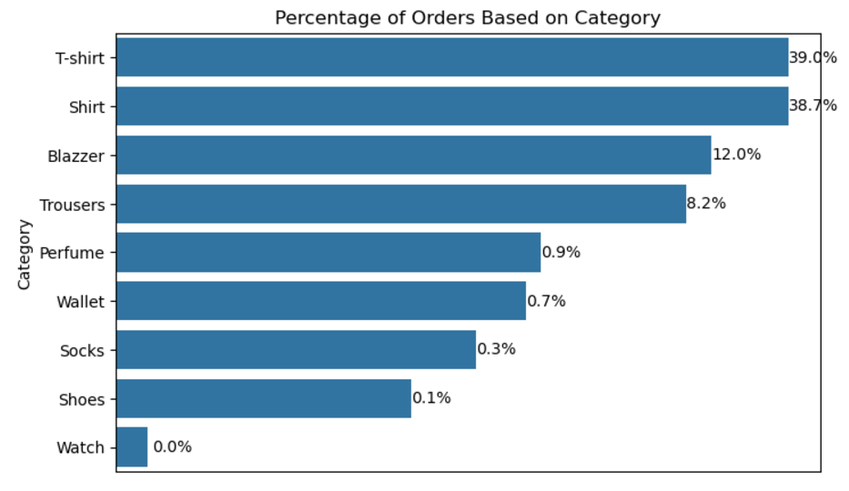

Insights:<br>
The top 3 selling categories are:<br>
1) T-shirt<br>
2) Shirt<br>
3) Blazzer<br>

### Distribution of Order Percentages by Size<br>
```python
order_counts = amz.groupby('Size').size()
order_percentages = (order_counts / len(amz)) * 100
order_summary = pd.DataFrame({'Order Count': order_counts, 'Percentage': order_percentages})
order_summary
```

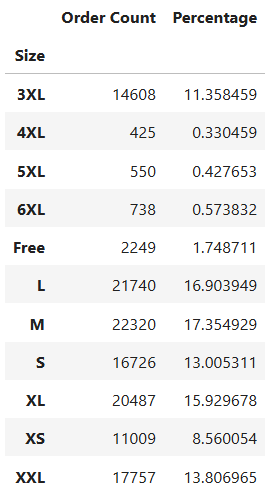

```python
st = sns.countplot(x='Size', data=amz, order=['XS','S','M','L','XL','XXL','3XL','4XL','5XL','3XL','Free'])
plt.xticks(rotation=90)
plt.yscale('log')
plt.grid(False)
plt.gca().get_yaxis().set_visible(False)

for p in st.patches:
    height = p.get_height()
    category = p.get_x() + p.get_width() / 2
    percentage = (height / len(amz)) * 100
    st.text(p.get_x() + p.get_width() / 2, height + 0.2, f'{percentage:.1f}%', 
            ha='center', va='bottom', fontsize=10)

plt.title('Percentage of Orders base on Size')
plt.show()
```

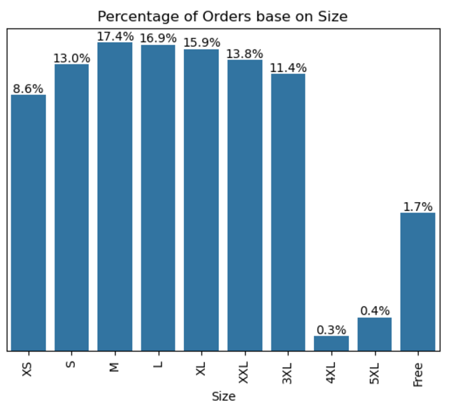

Insights:<br>
Size M is the best-selling, while size 4XL is the least popular.<br>

### Distribution of Order Percentages by Courier Status<br>
```python
order_counts = amz.groupby('Courier Status').size()
order_percentages = (order_counts / len(amz)) * 100
order_summary = pd.DataFrame({'Order Count': order_counts, 'Percentage': order_percentages})
order_summary
```

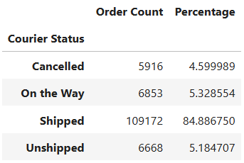

```python
plt.pie(amz['Courier Status'].value_counts(), labels=amz['Courier Status'].value_counts().index, 
        autopct='%1.1f%%', startangle=90, colors=plt.cm.Paired.colors, wedgeprops={'width': 0.3, 'edgecolor': 'white'},
       pctdistance=0.9,labeldistance=1.05 )
plt.title('Percentage of Orders Based on Courier Status')
plt.show()
```

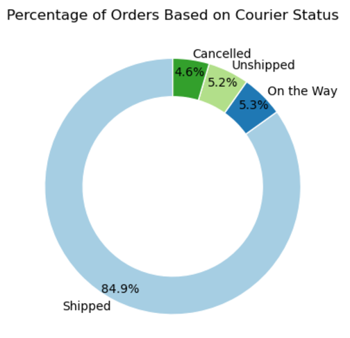

Insights:<br>
4.6% of orders are canceled, an issue that needs to be addressed. Additionally, 5.2% of orders remain unshipped, presenting an area for improvement.<br>

### Distribution of Order Percentages by Quantity<br>
```python
order_counts = amz.groupby('Quantity').size()
order_percentages = (order_counts / len(amz)) * 100
order_summary = pd.DataFrame({'Order Count': order_counts, 'Percentage': order_percentages})
order_summary
```

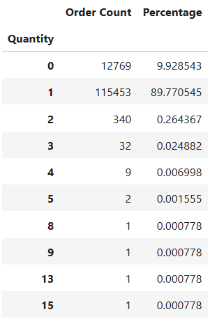

```python
plt.figure(figsize = (8,5))
st = sns.countplot(x='Quantity', data=amz)
plt.xticks(rotation=90)
plt.yscale('log')
plt.grid(False)
plt.gca().get_yaxis().set_visible(False)

for p in st.patches:
    height = p.get_height()
    category = p.get_x() + p.get_width() / 2
    percentage = (height / len(amz)) * 100
    st.text(p.get_x() + p.get_width() / 2, height + 0.2, f'{percentage:.3f}%', 
            ha='center', va='bottom', fontsize=10, rotation=45)

plt.title('Percentage of Orders based on Quantity')
plt.show()
```

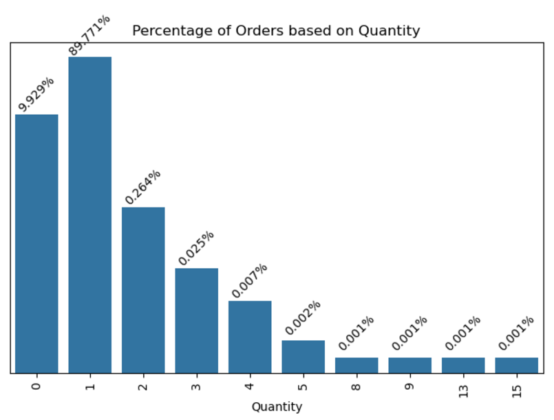

Insights:<br>
89.77% of customers place orders with a quantity of 1, indicating a strong preference for smaller purchases, which presents an opportunity to encourage larger orders.<br>

### Distribution of Order Percentages by Amount<br>
```python
amz['Amount'].min(),amz['Amount'].max()
```
(0.0, 5584.0)

```python
order_counts = pd.cut(amz['Amount'], bins=np.arange(0, 6001, 500), right=False).value_counts()
order_percentages = (order_counts / len(amz)) * 100
order_summary = pd.DataFrame({'Order Count': order_counts,'Percentage': order_percentages})
order_summary
```

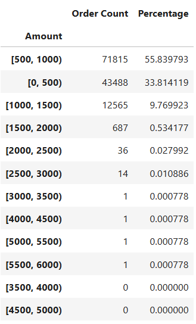

```python
plt.figure(figsize = (8,5))
st = sns.histplot(amz['Amount'], bins=np.arange(0, 6001, 500))
for p in st.patches:
    height = p.get_height()
    category = p.get_x() + p.get_width() / 2
    percentage = (height / len(amz)) * 100
    st.text(p.get_x() + p.get_width() / 2, height + 0.2, f'{percentage:.3f}%', 
            ha='center', va='top', fontsize=8, rotation=45)
plt.yscale('log')
plt.xlim(0, 6000)
plt.gca().get_yaxis().set_visible(False)
plt.title('Percentage distribution of orders based on Amount')
plt.show()
```

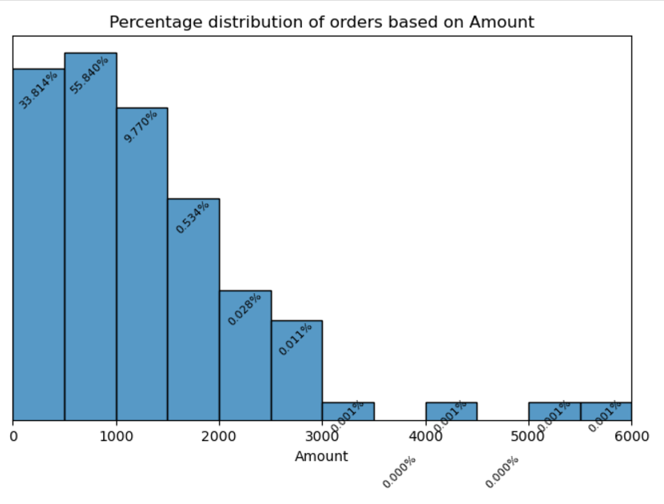

Insights:<br>
Most of the order volume falls within the INR 500-600 range, with order volume decreasing as the order amount exceeds INR 1000.<br>

### Distribution of Order Percentages by States<br>
```python
order_counts = amz['ship-state'].value_counts().nlargest(5)
order_percentages = (order_counts / len(amz)) * 100
top_5_summary = pd.DataFrame({'Order Count': order_counts,'Percentage': order_percentages})
top_5_summary
```

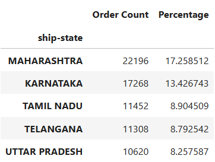

```python
order_counts = amz['ship-state'].value_counts().nsmallest(5)
order_percentages = (order_counts / len(amz)) * 100
bottom_5_summary = pd.DataFrame({'Order Count': order_counts,'Percentage': order_percentages})
bottom_5_summary
```

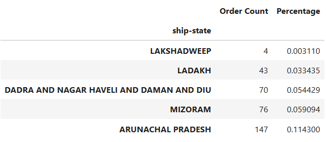

```python
plt.figure(figsize=(10, 8))

top_5_states = amz['ship-state'].value_counts().nlargest(5).index
plt.subplot(1, 2, 1)
st_top = sns.countplot(x='ship-state', data=amz[amz['ship-state'].isin(top_5_states)], order=top_5_states, color='skyblue')
plt.xticks(rotation=90)
plt.grid(False)
plt.gca().get_yaxis().set_visible(False)
plt.title('Top 5 Ship States by Order Count')

for p in st_top.patches:
    height = p.get_height()
    percentage = (height / len(amz)) * 100
    st_top.text(p.get_x() + p.get_width() / 2, height + 0.2, f'{percentage:.3f}%', ha='center', va='bottom', fontsize=10)

bottom_5_states = amz['ship-state'].value_counts().nsmallest(5).index
plt.subplot(1, 2, 2)
st_bottom = sns.countplot(x='ship-state', data=amz[amz['ship-state'].isin(bottom_5_states)], order=bottom_5_states, color='lightcoral')
plt.xticks(rotation=90)
plt.grid(False)
plt.gca().get_yaxis().set_visible(False)
plt.title('Bottom 5 Ship States by Order Count')

for q in st_bottom.patches:
    height = q.get_height()
    percentage = (height / len(amz)) * 100
    st_bottom.text(q.get_x() + q.get_width() / 2, height/2, f'{percentage:.6f}%', ha='center', va='center', fontsize=10)

plt.tight_layout()
plt.show()
```

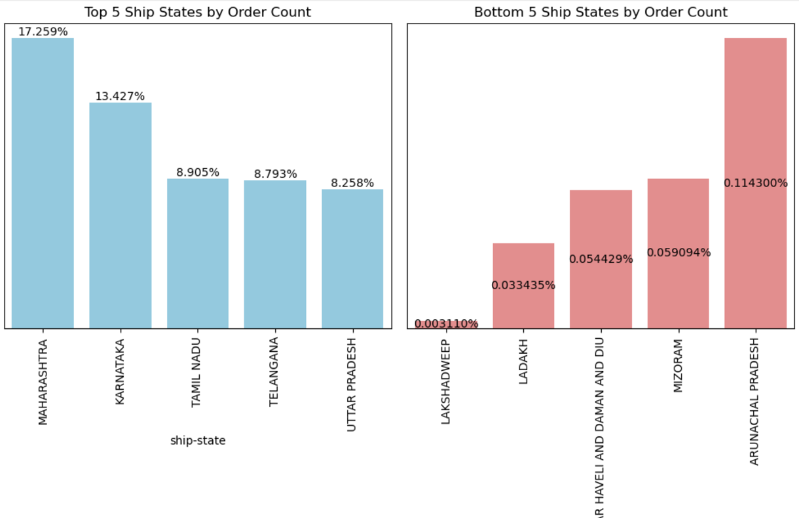

Insights:<br>
The highest order volume comes from Maharashtra, followed by Karnataka and Tamil Nadu. States with the lowest order volumes include LAKSHADWEEP, LADAKH and DADRA AND NAGAR HAVELI AND DAMAN AND DIU.<br>

### Distribution of Order Percentages by Cities<br>
```python
order_counts = amz['ship-city'].value_counts().nlargest(5)
order_percentages = (order_counts / len(amz)) * 100
top_5_summary = pd.DataFrame({'Order Count': order_counts,'Percentage': order_percentages})
top_5_summary
```

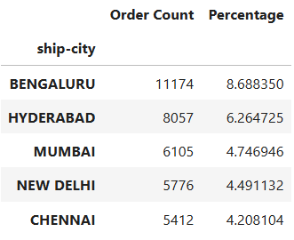

```python
order_counts = amz['ship-city'].value_counts().nsmallest(5)
order_percentages = (order_counts / len(amz)) * 100
bottom_5_summary = pd.DataFrame({'Order Count': order_counts,'Percentage': order_percentages})
bottom_5_summary
```

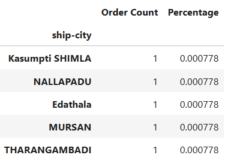

```python
plt.figure(figsize=(10, 5))

top_5_states = amz['ship-city'].value_counts().nlargest(5).index
plt.subplot(1, 2, 1)
st_top = sns.countplot(x='ship-city', data=amz[amz['ship-city'].isin(top_5_states)], order=top_5_states, color='skyblue')
plt.xticks(rotation=90)
plt.grid(False)
plt.gca().get_yaxis().set_visible(False)
plt.title('Top 5 Ship cities by Order Count')

for p in st_top.patches:
    height = p.get_height()
    percentage = (height / len(amz)) * 100
    st_top.text(p.get_x() + p.get_width() / 2, height + 0.2, f'{percentage:.3f}%', ha='center', va='bottom', fontsize=10)

bottom_5_states = amz['ship-city'].value_counts().nsmallest(5).index
plt.subplot(1, 2, 2)
st_bottom = sns.countplot(x='ship-city', data=amz[amz['ship-city'].isin(bottom_5_states)], order=bottom_5_states, color='lightcoral')
plt.xticks(rotation=90)
plt.grid(False)
plt.gca().get_yaxis().set_visible(False)
plt.title('Bottom 5 Ship cities by Order Count')

for q in st_bottom.patches:
    height = q.get_height()
    percentage = (height / len(amz)) * 100
    st_bottom.text(q.get_x() + q.get_width() / 2, height/2, f'{percentage:.6f}%', ha='center', va='center', fontsize=10)

plt.tight_layout()
plt.show()
```

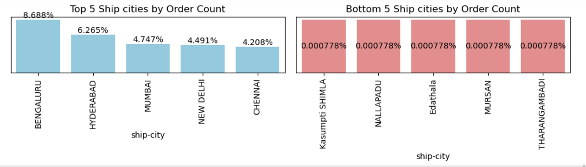

Insights:<br>
The highest order volume comes from Bengaluru, followed by Hyderabad and Mumbai. Cities with the lowest order volumes include Kasumpti SHIMLA, NALLAPADU, and Edathala.<br>

### Distribution of Order Percentages by Postal Code<br>
```python
order_counts = amz['ship-postal-code'].value_counts().nlargest(5)
order_percentages = (order_counts / len(amz)) * 100
top_5_summary = pd.DataFrame({'Order Count': order_counts,'Percentage': order_percentages})
top_5_summary
```

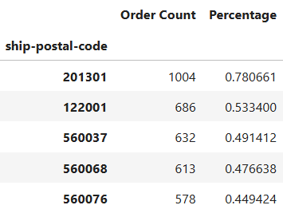

```python
order_counts = amz['ship-postal-code'].value_counts().nsmallest(5)
order_percentages = (order_counts / len(amz)) * 100
bottom_5_summary = pd.DataFrame({'Order Count': order_counts,'Percentage': order_percentages})
bottom_5_summary
```

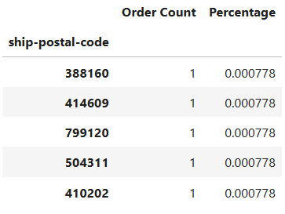

```python
plt.figure(figsize=(10, 5))

top_5_states = amz['ship-postal-code'].value_counts().nlargest(5).index
plt.subplot(1, 2, 1)
st_top = sns.countplot(x='ship-postal-code', data=amz[amz['ship-postal-code'].isin(top_5_states)], order=top_5_states, color='skyblue')
plt.xticks(rotation=90)
plt.grid(False)
plt.gca().get_yaxis().set_visible(False)
plt.title('Top 5 ship-postal-code by Order Count')

for p in st_top.patches:
    height = p.get_height()
    percentage = (height / len(amz)) * 100
    st_top.text(p.get_x() + p.get_width() / 2, height + 0.2, f'{percentage:.3f}%', ha='center', va='bottom', fontsize=10)

bottom_5_states = amz['ship-postal-code'].value_counts().nsmallest(5).index
plt.subplot(1, 2, 2)
st_bottom = sns.countplot(x='ship-postal-code', data=amz[amz['ship-postal-code'].isin(bottom_5_states)], order=bottom_5_states, color='lightcoral')
plt.xticks(rotation=90)
plt.grid(False)
plt.gca().get_yaxis().set_visible(False)
plt.title('Bottom 5 ship-postal-code by Order Count')

for q in st_bottom.patches:
    height = q.get_height()
    percentage = (height / len(amz)) * 100
    st_bottom.text(q.get_x() + q.get_width() / 2, height/2, f'{percentage:.3f}%', ha='center', va='center', fontsize=10)

plt.tight_layout()
plt.show()
```

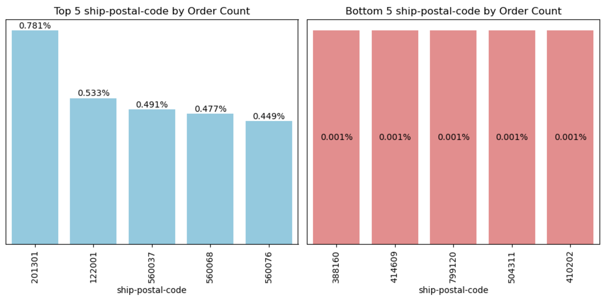

Insights:<br>
The highest order volume comes from 201301, followed by 122001 and 560037. Cities with the lowest order volumes include 388160, 414609, and 799120.<br>

### Distribution of Order Percentages by B2B<br>
```python
order_counts = amz.groupby('B2B').size()
order_percentages = (order_counts / len(amz)) * 100
order_summary = pd.DataFrame({'Order Count': order_counts, 'Percentage': order_percentages})
order_summary
```

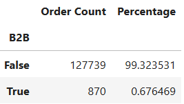

```python
plt.pie(amz['B2B'].value_counts(), labels=amz['B2B'].value_counts().index, autopct='%1.1f%%', startangle=90, colors=plt.cm.Paired.colors)
plt.title('B2B or not?')
plt.show()
```
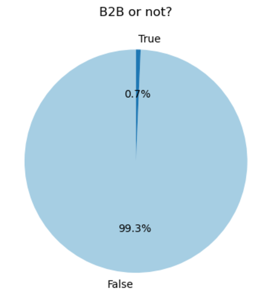

Insights:<br>
With only 0.7% of orders being B2B, there is significant potential to expand Amazon's B2B offerings.<br>

### Distribution of Order Percentages by Fulfilled by<br>
```python
order_counts = amz.groupby('fulfilled-by').size()
order_percentages = (order_counts / len(amz)) * 100
order_summary = pd.DataFrame({'Order Count': order_counts, 'Percentage': order_percentages})
order_summary
```

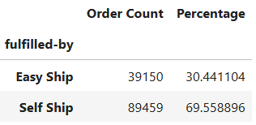

```python
plt.pie(amz['fulfilled-by'].value_counts(), labels=amz['fulfilled-by'].value_counts().index, autopct='%1.1f%%', startangle=90, colors=plt.cm.Paired.colors)
plt.title('fulfilled-by:')
plt.show()
```
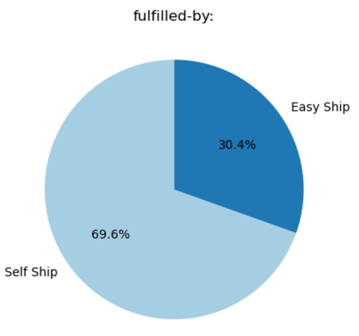

Insights:<br>
30.4% of orders are fulfilled by Easy Ship, indicating significant potential for Amazon to expand its fulfillment capabilities.<br>

## Conclusion:<br>
- Conducted data cleaning and preprocessing to resolve duplicates, missing values, and inconsistent data types, ensuring a reliable dataset for analysis.
- Performed exploratory data analysis (EDA) to uncover insights on top-selling categories, regional trends, and customer preferences, enabling informed decision-making.
- Identified inefficiencies, including a 14.21% cancellation rate and 5.2% unshipped orders, and recommended strategies to enhance user experiance and reduce cancellations.
